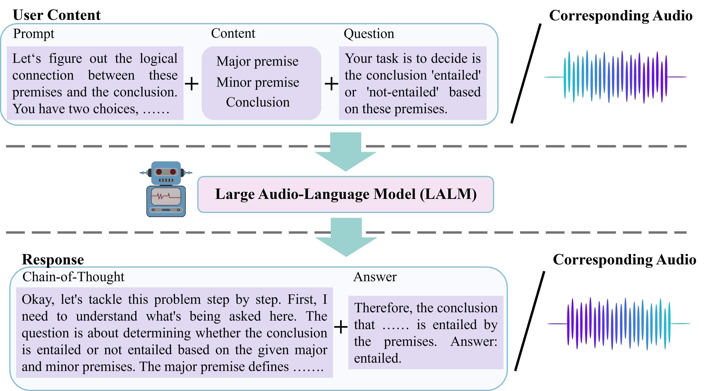
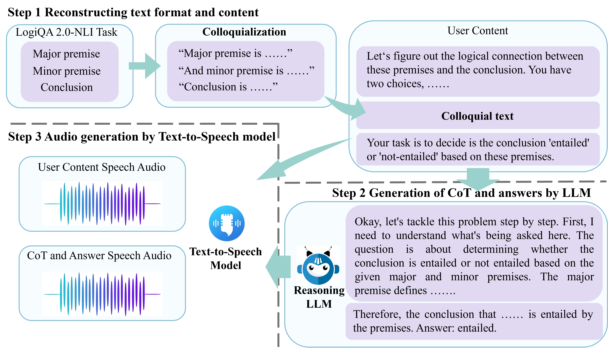

# SoundMind: RL-Incentivized Logic Reasoning for Audio-Language Models

This repository is the official implementation of **SoundMind: RL-Incentivized Logic Reasoning for Audio-Language Models**. 



## Requirements

### Recommended Hardware

8× NVIDIA H800 80GB or 8× NVIDIA H100 80GB GPUs.

### Codebase and Compatibility

Our codebase is based on [verl](https://github.com/volcengine/verl). If you are already familiar with [verl](https://github.com/volcengine/verl), you should be able to quickly get started with this repository.

### Environment Setup (Recommended: Anaconda)

- **Python**: Version >= 3.9
- **CUDA**: Version >= 12.1

For training and inference engines to utilize better and faster hardware support, CUDA/cuDNN and other dependencies are required, and some of the dependencies are easy to be overridden when installing other packages.

We need to install the following pre-requisites:

- **CUDA**: Version >= 12.4
- **cuDNN**: Version >= 9.8.0


```bash
# change directory to anywhere you like, in verl source code directory is not recommended
wget https://developer.download.nvidia.com/compute/cudnn/9.8.0/local_installers/cudnn-local-repo-ubuntu2204-9.8.0_1.0-1_amd64.deb
dpkg -i cudnn-local-repo-ubuntu2204-9.8.0_1.0-1_amd64.deb
cp /var/cudnn-local-repo-ubuntu2204-9.8.0/cudnn-*-keyring.gpg /usr/share/keyrings/
apt-get update
apt-get -y install cudnn-cuda-12
```


Create and activate a new conda environment:

```bash
conda create -n alr python==3.10
conda activate alr
```

Install verl:

```bash
bash scripts/install_vllm_sglang_mcore.sh
pip install --no-deps -e .
```


Please make sure that the installed packages are not overridden during the installation of other packages.

The packages worth checking are:

- **torch** and torch series
- **vLLM**
- **SGLang**
- **pyarrow**
- **tensordict**


For [Qwen2.5-Omni](https://github.com/QwenLM/Qwen2.5-Omni), we need to update some additional library versions.


```bash
pip install transformers==4.52.3
pip install accelerate
pip install qwen-omni-utils[decord] -U
```


## Preprocessing Data
Our project and code rely on  Audio Logical Reasoning (ALR) dataset.





### Generate Parquet Format Dataset


- **Option 1: Two modal inputs are used**

```bash
cd ./examples/data_preprocess
python alr.py
```


- **Option 2: Only texts are used**

```bash
cd ./examples/data_preprocess
python alr_text.py
```


- **Option 3: Only audio is used**

```bash
cd ./examples/data_preprocess
python alr_audio.py
```


## RL-Training & Evaluation

If you don't want to use the pre-trained model we provided, you can use the official version. You can change the model path implementation in download_qwen25omni.py and main_grpo.sh.


Run the following command:

```bash
python download_qwen25omni.py
bash main_grpo.sh
```


## Results


**The main results of our paper are shown below:**


| Inputs        | Output | Accuracy (%) | WER (%) |
|---------------|--------|--------------|---------|
| **Audio**     | Text   | 81.40        | /       |
| **Text**      | Audio  | 83.84        | 6.99    |
| **Audio** | Audio  | 81.40        | 8.95    |


## Dataset Download

To download our dataset, please visit this link: [Dataset Link](https://www.dropbox.com/scl/fi/irtbrnmk5e0ecvv8fyrum/audio_dataset.zip?rlkey=p1ebkt9h1bkyjsq3fo2bp667v&st=gxr542e2&dl=0)

Run the following command:

```bash
wget -c "https://www.dropbox.com/scl/fi/irtbrnmk5e0ecvv8fyrum/audio_dataset.zip?rlkey=p1ebkt9h1bkyjsq3fo2bp667v&st=gxr542e2&dl=1" -O audio_dataset.zip
```

Alternatively, you can also download it from [Hugging Face](https://huggingface.co/datasets/SoundMind-RL/SoundMindDataset).

The dataset contains train, test, and validation splits with corresponding text descriptions and metadata stored as JSON files. All annotation files are located in the `dataset-annotation-json` folder in this github.
